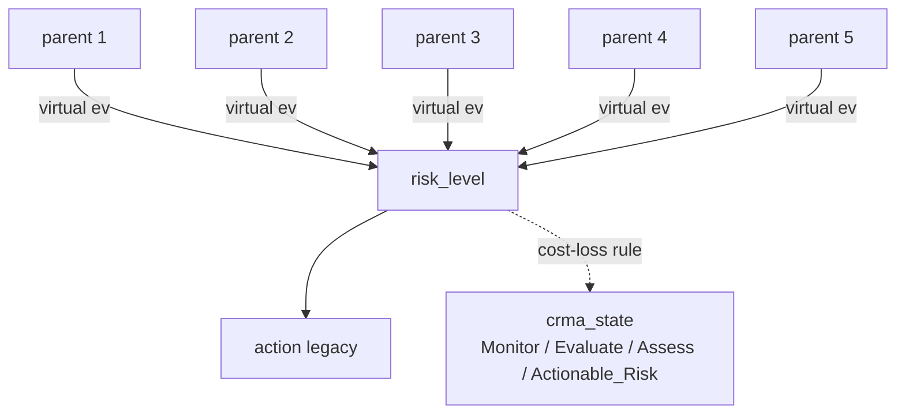

# BN structure: drought vs flood (Julia / RxInfer)

Both `flood_ibf/flood_bn_ibf_v1.jl` and `drought_ibf/drought_bn_ibf_v1.jl`
implement the **same** discrete Bayesian Network topology with RxInfer
message passing. Only the parent semantics, bin cutoffs, and CPT stress
weights differ. This page lists what is identical and what is
domain-specific.

---

## Graph (identical)



Plain ASCII (in case the renderer skips Mermaid):

```
   parent 1 ──┐
   parent 2 ──┤
   parent 3 ──┼── DiscreteTransition(parent₁, T, parent₂, parent₃, parent₄, parent₅) ──► risk_level ──► action
   parent 4 ──┤                                                                                 │
   parent 5 ──┘                                                                                 │
                                                              cost-loss rule on posterior  ──►  crma_state
```

Soft evidence is injected through identity channels:
`parent_data ~ DiscreteTransition(parent, I_K)` — fed a probability
vector at inference time. One-hot vectors recover hard classification.

---

## Parent nodes — side by side

| Slot | Flood node + states | Drought node + states |
|---|---|---|
| **P1 (size 5)** | `antecedent_rainfall` :: Dry / Normal / Wet / Very_Wet / **Saturated** | `current_spi3` :: Above_Normal / Normal / Mild / Moderate / **Severe** |
| **P2 (size 5)** | `exceedance_prob` :: Very_Low / Low / Medium / High / **Very_High** (P(TP ≥ RP)) | `deficit_prob` :: Very_Low / Low / Medium / High / **Very_High** (P(SPI ≤ −1)) |
| **P3 (size 3)** | `spatial_coverage` :: Localized / Moderate / **Widespread** | `spatial_coverage` :: Localized / Moderate / **Widespread** |
| **P4 (size 3)** | `rainfall_trend` :: Decreasing / Stable / **Increasing** (slope mm/day) | `spi3_trend` :: Improving / Stable / **Deteriorating** (slope SPI/month) |
| **P5 (size 4)** | `tail_risk` :: Nil / Low / Moderate / **High**  (p95 of ens_max ÷ RP) | `tail_risk` :: Nil / Low / Moderate / **High**  (p5  of ens_min SPI) |
| optional | `forecast_agreement` (3) — collapses RxInfer to matmul-only | `forecast_agreement` (3) — same disabled-by-default |

**Bold** = "most-stressed" state (worst case for the hazard).

The parent indices in the Julia code are *increasing-stress*: index 1 is
always least stressful, index N is always most stressful. The drought
script reorders `current_spi3` so that `Severe_Drought=5` matches
`Saturated=5` in flood — both are the "extreme stress" end.

---

## Bin cutoffs — side by side

### P1: antecedent state

| Flood (`antecedent_rainfall_mm`) | Drought (`current_spi3`) |
|---|---|
| `< 10 mm  → Dry`                   | `≥ +0.5      → Above_Normal`     |
| `< 30 mm  → Normal`                | `−0.5 .. +0.5 → Normal`           |
| `< 60 mm  → Wet`                   | `−1.0 .. −0.5 → Mild_Drought`     |
| `< 100 mm → Very_Wet`              | `−1.5 .. −1.0 → Moderate_Drought` |
| `≥ 100 mm → Saturated`             | `< −1.5      → Severe_Drought`   |

### P2: forecast probability

| Flood (`gefs_eprob_heavy`) | Drought (`forecast_deficit_prob`) |
|---|---|
| `< 0.2 → Very_Low`  | (same cutoffs) |
| `< 0.4 → Low`       |                |
| `< 0.6 → Medium`    |                |
| `< 0.8 → High`      |                |
| `≥ 0.8 → Very_High` |                |

(The threshold direction differs — flood: `P(TP ≥ RP)`, drought: `P(SPI ≤ −1.0)` — but the bin edges over the resulting probability are identical.)

### P3: spatial coverage — identical bins (`< 0.3 / 0.6`).

### P4: trend

| Flood (`slope mm/day`)      | Drought (`slope SPI/month`)  |
|---|---|
| `> +2  → Increasing` (worse) | `> +0.1 → Improving` (better) |
| `±2     → Stable`           | `±0.1   → Stable`             |
| `< −2  → Decreasing`        | `< −0.1 → Deteriorating` (worse) |

The trend axis is **inverted** between the two domains: rising rainfall is bad
for flood, rising SPI is good for drought. Internally both map to the
shared "stress index 1..3" with 1 = least worry, 3 = most worry — so the
CPT logic stays the same arithmetic, just feeding from opposite-sign signals.

### P5: tail risk

| Flood (`ens_max / RP`) | Drought (`ens_min SPI`) |
|---|---|
| `< 0.5 → Nil`              | `≥ −0.5 → Nil`              |
| `0.5 ≤ ratio < 1.0 → Low`   | `−1.0 ≤ SPI < −0.5 → Low`   |
| `1.0 ≤ ratio < 2.0 → Moderate` | `−1.5 ≤ SPI < −1.0 → Moderate` |
| `≥ 2.0 → High`             | `< −1.5 → High`             |

---

## CPT (`compute_risk_probs`) — identical structure

Both files share this exact function shape (5-vector over Risk = Minimal
.. Extreme):

```
base_risk = 0.30·(P1−1) + 0.55·(P2−1)
         + spatial modifier      ( +0.25 / +0.50 )
         + trend modifier        ( ±0.30 / +0.35 )
         + tail-risk modifier    ( +0.10 / +0.35 / +0.60 )

then 8 expert-rule overrides for specific scenarios
(saturated+heavy+rising;  dry+light+falling;  tail-risk-only;  etc.)

then a "soft" agreement modifier
(Low → 0.5·rules + 0.5·uniform; Medium → 0.8·rules + 0.2·uniform)
```

All the **numeric weights and rule probability vectors** are bit-for-bit
identical between flood and drought. Only the **state-name semantics
of the rules** change:

| Flood Rule                                    | Drought Rule (same numeric vector) |
|---|---|
| Saturated + Very_High eprob + Increasing → `[0,0,0.05,0.20,0.75]` | Severe_Drought + Very_High deficit + Deteriorating → `[0,0,0.05,0.20,0.75]` |
| Dry + Very_Low eprob + Decreasing → `[0.55,0.35,0.10,0,0]` | Above_Normal + Very_Low deficit + Improving → `[0.55,0.35,0.10,0,0]` |
| (etc. — 8 rules total in each)                | (corresponding drought analogues)  |

---

## RxInfer @model — identical shape

```julia
@model function flood_bn_model_5parent(T, ant_data, exc_data, spa_data, trn_data, tail_data, risk_data)
    ant  ~ Categorical(fill(1/5, 5))
    exc  ~ Categorical(fill(1/5, 5))
    spa  ~ Categorical(fill(1/3, 3))
    trn  ~ Categorical(fill(1/3, 3))
    tail ~ Categorical(fill(1/4, 4))
    ant_data  ~ DiscreteTransition(ant,  diageye(5))
    ...
    risk ~ DiscreteTransition(ant, T, exc, spa, trn, tail)
    risk_data ~ DiscreteTransition(risk, diageye(5))
end
```

```julia
@model function drought_bn_model_5parent(T, cur_data, def_data, spa_data, trn_data, tail_data, risk_data)
    cur  ~ Categorical(fill(1/5, 5))
    def  ~ Categorical(fill(1/5, 5))
    spa  ~ Categorical(fill(1/3, 3))
    trn  ~ Categorical(fill(1/3, 3))
    tail ~ Categorical(fill(1/4, 4))
    cur_data  ~ DiscreteTransition(cur,  diageye(5))
    ...
    risk ~ DiscreteTransition(cur, T, def, spa, trn, tail)
    risk_data ~ DiscreteTransition(risk, diageye(5))
end
```

Only the variable names (`ant→cur`, `exc→def`) and the soft-evidence
column prefixes (`ant_p*` → `cur_p*`, `exc_p*` → `def_p*`) change. The
factor graph, message-passing schedule, and `iterations=10` are
identical.

---

## CRMA decision (`compute_crma_state`) — identical

| State | Trigger | Light |
|---|---|---|
| **Actionable_Risk** | `P(High∪Extreme) ≥ γ`              | 🔴 Red    |
| **Assess**          | `P(Mod∪High∪Extreme) ≥ max(2γ, 0.40)` | 🟠 Orange |
| **Evaluate**        | `P(≥ Low) ≥ max(3γ, 0.30)`         | 🟡 Yellow |
| **Monitor**         | otherwise                           | 🟢 Green  |

Default `γ = 0.20` (FbF cost-loss ratio, mid-range for cash transfers
vs pre-positioned stockpiles, Lopez et al. 2020). Same default in both
domains — set per-domain via `--cost-loss-ratio` if needed.

---

## DBN temporal coupling — same shape, different cadence

| | Flood | Drought |
|---|---|---|
| Time step | day | month |
| Default decay α | 0.6 | 0.6 |
| Default lookback L | 7 days (= forecast horizon) | 6 months (= 6-lead SEAS5 horizon) |
| Reset rule | every L consecutive days | every L consecutive months |

The blending formula `v_t = α · r_{t-1} + (1-α) · uniform_5` and the
multiplicative virtual-evidence injection on `risk_data` are identical.

---

## Per-member storyline picker — identical

`run_per_member_bn` (over the per-member sidecar from data prep) and
`select_storylines` (worst / median / best by `P(High∪Extreme)`) are
copy-rename of the flood functions. Drought reads `member_min_spi` and
`member_def_frac` instead of the flood `member_max_ratio` and
`member_exc_frac`, but the picker logic is unchanged.

---

## Summary — what changes, what doesn't

| Layer | Status |
|---|---|
| Graph topology (5 parents → risk → action; CRMA derived) | **identical** |
| State cardinalities (5/5/3/3/4 → 5 → 4) | **identical** |
| RxInfer @model factor graph | **identical** (variable names renamed) |
| Direct-matmul fallback / tensor contraction | **identical** |
| `compute_risk_probs` arithmetic + rule probability vectors | **identical** |
| `compute_crma_state` cost-loss rule | **identical** |
| DBN temporal blend, per-member storyline picker | **identical** (cadence param differs) |
| **Parent semantics** (what physical signal each parent encodes) | **domain-specific** |
| **Bin cutoffs** (mm vs SPI; SPI/month vs mm/day) | **domain-specific** |
| **Threshold direction** (TP ≥ RP vs SPI ≤ RP) | **domain-specific** |
| **Tail metric** (ens_max ratio vs ens_min SPI) | **domain-specific** |

The clean split between "BN engine" (identical, well-tested in flood)
and "domain mapping" (small, audited per hazard) is what made the
1247→1027-line port tractable.

---

# Drought BN v2 — seasonal redesign (planned)

The v1 drought BN (above) is a single-month snapshot: it asks
"what's the drought risk this month given current SPI3 + a 6-lead
ensemble forecast?". That structure ports flood's daily snapshot well
but **leaves the seasonal climatology of East Africa on the table** —
SPI3 evidence is most meaningful when interpreted at season level
(MAM, JJA, OND, DJF), and the SEAS5.1 lead-time table in
`drought_crma/itt-seasonal-docs.rst` makes the mapping explicit.

v2 reorganises the same 5-parent topology around **seasons** rather
than calendar months, and restricts the ensemble-derived parents to
the **first 25 SEAS5.1 members** (the only block with a complete
1981–present hindcast — see "Why first 25 members" below).

## Target seasons (from `itt-seasonal-docs.rst`, lines 72-112)

| Season | Months | Valid (SPI-3 anchor) | Init months & lead indices |
|---|---|---|---|
| **MAM** | Mar–Apr–May | May (m=5) | Dec lead 4, Jan lead 3, Feb lead 2 |
| **JJA** | Jun–Jul–Aug | Aug (m=8) | Mar lead 4, Apr lead 3, May lead 2 |
| **OND** | Sep–Oct–Nov | Nov (m=11) | Jun lead 4, Jul lead 3, Aug lead 2 |
| **DJF** | Dec–Jan–Feb | Feb (m=2) | Sep lead 4, Oct lead 3, Nov lead 2 |

`lead_idx = (target_valid_month − init_month) mod 12 − 1` (0-based).
The script driver picks the target season from the run config; the
init month is "this month" (the latest available SEAS5.1 init); the
lead index falls out of the table.

In v2 the BN runs **once per (boundary × target_season)** — typically
the current season + the next two — instead of once per (boundary).

## Per-parent changes (drought v1 → drought v2)

| Slot | v1 (single snapshot) | v2 (seasonal) |
|---|---|---|
| **P1 `current_spi3`** | latest single-month ERA5 SPI3 value at boundary | ERA5 SPI3 across the **last 6 months** at boundary, **bucketed by season** (mean SPI3 per season in the lookback). The "value" passed to the categoriser is the SPI3 of the season *immediately preceding* the target — i.e. how dry are we *going into* the target window. |
| **P2 `deficit_prob`** | mean over leads of `P(SPI ≤ −1)` across all 51 members | for the **target season only**, mean of `P(SPI ≤ RP_threshold)` over the leads pointing to that season's months, using **members 0..24** (first 25, see below). Three leads per season per init (table above). |
| **P3 `spatial_coverage`** | unchanged (max of P_deficit ≥ 0.5 mask & hotspot fraction) | unchanged in form; same metric computed on the season-restricted forecast slice. |
| **P4 `spi3_trend`** | slope of last 6 months' ERA5 SPI3 (slope SPI/month) | **same metric** but explicitly tied to the obs window described in P1; documented as "6-month obs slope". |
| **P5 `tail_risk`** | p5 of ens-min SPI across all leads × 51 members | p5 of ens-min SPI across the **target-season's leads × first 25 members**. |

Forecast-agreement (P6, optional) stays the same.

## Threshold source: `era5_ecmwf_rp_icechunk` (per-pixel SPI RPs)

The deficit threshold used inside P2 is **no longer hardcoded at -1.0**.
v2 reads the per-pixel fitted SPI return-period thresholds from
`e4drr-project/observations/era5_ecmwf_rp_icechunk` (already loaded by
v1 prep but only for diagnostic columns). The default RP for triggers
is **5-yr** (≈ -0.84 SPI) — matches the threshold defaults in
`07-plot-sea51-forecast.py` (`-0.68 / -0.84`).

`P(SPI_lead ≤ RP_pixel(rp_year))` then varies in space, capturing the
fact that a -1.0 SPI is a 5-yr event in arid Karamoja but a 10-yr event
in the Lake Victoria basin.

## Why the first 25 members (calibration coverage)

SEAS5 system-51 has 51 ensemble members but their historical coverage
differs:

- **Members 0–24** are present in the **full hindcast / reanalysis
  block 1981–present** — the same 25 members are re-run for every
  past month, providing a continuous 1981–now climatology.
- **Members 25–50** were **added from 2017 onwards** as an extended
  ensemble. Before 2017 these members do not exist.

For SPI calibration, we need a continuous reference period (the SPI
gamma fit uses 1981–2024 in `01-run-process-spi.py`, lines 561-573,
with cal windows `1991-01..2018-01` for members <25 and a shorter
`2017-01..2024-01` for members ≥25 — exactly because the first
calibration window can't be applied to the post-2017-only members).

To keep the **calibration period identical across all the members
feeding the BN**, v2 restricts P2 (deficit prob) and P5 (tail risk)
to `members[0:25]`. The remaining 26 members are still present in
the published forecast store; they're just left out of the BN evidence
to avoid mixing two different calibration regimes.

v2 applies `fcst.isel(member=slice(0, 25))` consistently for both
**P2** (deficit prob) and **P5** (tail risk). v1's per-member sidecar
remains unchanged (still emits all 51 for storyline picking).

## Run cadence

v1 cadence: 1 BN run per boundary per month (227 runs / month).

v2 cadence: 1 BN run per boundary per (target_season, init_month).

| Init month | Target seasons | BN runs/month |
|---|---|---|
| Jan | MAM (this year, lead 3); JJA (lead 6) | 227 × 2 = 454 |
| Feb | MAM (lead 2); JJA (lead 5) | 454 |
| Mar | JJA (lead 4); … | 454 |
| Apr | JJA (lead 3); OND (lead 6) | 454 |
| ... | ... | ... |

Approximately doubles the per-boundary count, still well under the
flood pipeline's 227 boundaries × 7 lead durations × 51 members
storyline volume.

## Output schema (v2)

```
id, name, country, target_date, init_month,
target_season,            # MAM / JJA / OND / DJF
lead_indices_used,        # e.g. "2,3,4" (the 3 leads for this season from this init)

# P1 evidence (per-season obs)
current_spi3_target_season,        # SPI3 of the season immediately before target
season_means_obs,                  # JSON: {"OND_2025": -0.4, "DJF_2025-26": -0.8, ...}
current_spi3_category,             # 5-state hard label

# P2 evidence (per-season forecast)
forecast_deficit_prob,             # mean over season's leads, members 0..24
deficit_threshold_used,            # the RP-derived SPI threshold
deficit_threshold_source,          # e.g. "era5_ecmwf_rp_icechunk:5yr fitted"

# P3
spatial_coverage,
spatial_cov_mean_p, hotspot_fraction,

# P4
spi3_trend, trend_slope_spi_per_month,

# P5 (tail) — first 25 members only
ens_min_spi_25, ens_min_spi_25_mean, ens_min_spi_25_peak,

# Diagnostics
ens_mean_target_spi, ens_min_target_spi, ens_max_target_spi,

# Optional soft-evidence cols (same prefixes as v1: cur, def, spa, trn, tail)
```

`drought_bn_ibf_v1.jl` reads this schema as-is — only `current_spi3` →
`current_spi3_target_season` is renamed in the BoundaryInput
constructor, and the new `target_season` / `init_month` columns are
passed through to the output. **The BN engine is unchanged.**

## Implementation plan

1. **`drought_data_prep.py` v2** (~30 % rewrite of v1):
   - new CLI: `--init-month YYYY-MM --target-season {MAM,JJA,OND,DJF}` (replacing `--date`)
   - season → lead-index lookup table from the seasonal doc
   - obs window: last 6 months pre-target, bucketed by season
   - forecast slice: pick lead indices for the target season,
     `members 0..24`, then compute `P(SPI ≤ RP_pixel(rp_year))`
   - per-pixel RP threshold from `era5_ecmwf_rp_icechunk` (already in
     the prep imports, just consume it for P2 too)
   - tail: `fcst.isel(member=slice(0, 25)).min(dim=("member", "lead"))`
   - new output columns listed above
2. **`drought_bn_ibf_v1.jl`**:
   - rename `current_spi3` → `current_spi3_target_season` in the CSV
     reader (1-line change)
   - emit `target_season` + `init_month` in the result CSV (5-line
     change in `run_csv`)
   - **no changes to the BN engine, the @model functions, the CPT, or
     the CRMA decision rule.**
3. **`drought_bn_ibf_v1.py`** (reference): mirror the column-name
   change; its CPT divergence with the Julia version is unchanged.
4. **README** + this doc: add a "v2 / seasonal" section above the
   "Usage" examples; keep v1 examples for back-compat until v2 is
   verified.
5. **Optional driver script** `run_drought_bn_seasonal.sh`:
   loop over (init_month, target_season) pairs for the upcoming
   seasons and call prep + BN per pair.

## What stays identical (v1 → v2)

- Graph topology (5 parents → risk → action; CRMA derived).
- State cardinalities (5/5/3/3/4 → 5 → 4).
- RxInfer `@model` factor graph + DiscreteTransition + diageye channels.
- `compute_risk_probs` arithmetic + 8 expert-rule probability vectors.
- `compute_crma_state` cost-loss decision rule (γ default 0.20).
- DBN temporal coupling structure (cadence becomes per-season-init).
- Per-member storyline picker.
- Soft-evidence column prefixes (`cur, def, spa, trn, tail`).

The redesign is a **prep-side reorganisation** of how the 5 evidence
values are computed; the inference layer is untouched.

## Open questions for review

1. **Trend window vs target season**: should the slope come from the
   last 6 obs months (current v1) or only from the season(s) leading
   into the target (e.g. MAM target → use only DJF slope)? The latter
   tightens the seasonal interpretation but may give a noisier slope.
2. **DBN chaining**: v1 chains month-to-month. v2's natural chain is
   season-to-season for a fixed target — i.e. the MAM-from-Dec
   posterior priors the MAM-from-Jan run. Lookback would be the
   3 inits-per-target sequence rather than 6 calendar months.
3. **Storyline picker on 25 members vs 51**: v2 uses members 0–24 for
   the BN evidence; the per-member sidecar still sweeps all 51 for
   variety. Should the storyline picker also restrict to 0–24 for
   consistency with the calibration window, or keep 51 for diversity
   (members 25–50 still have valid post-2017 climatology)?
4. **Multi-season simultaneous output**: the cleanest run pattern is
   1 BN call per (boundary × target_season). Should the result CSV
   pivot back to one-row-per-boundary with `risk_*_{MAM,JJA,OND,DJF}`
   columns, or keep one-row-per-(boundary, season) long format? Long
   format is simpler for downstream (mirrors flood's per-day rows).
5. **RP year as evidence axis**: v2 fixes RP year per run. We could
   instead emit P2 across multiple RP years (3, 5, 10, 20, 50) as
   sensitivity columns and let the BN consume the user-chosen one.
   v1 already accepts `--rp-years`; v2 keeps the same convention.

A first cut of v2 prep + the 6-line BN driver patch is a ~1-day task
and can land on a `drought-v2-seasonal` branch alongside this doc.
