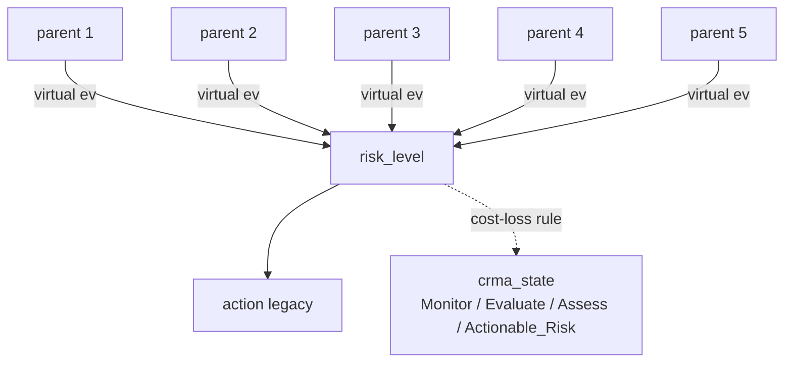

# BN structure: drought vs flood (Julia / RxInfer)

Both `flood_ibf/flood_bn_ibf_v1.jl` and `drought_ibf/drought_bn_ibf_v1.jl`
implement the **same** discrete Bayesian Network topology with RxInfer
message passing. Only the parent semantics, bin cutoffs, and CPT stress
weights differ. This page lists what is identical and what is
domain-specific.

---

## Graph (identical)



Plain ASCII (in case the renderer skips Mermaid):

```
   parent 1 ──┐
   parent 2 ──┤
   parent 3 ──┼── DiscreteTransition(parent₁, T, parent₂, parent₃, parent₄, parent₅) ──► risk_level ──► action
   parent 4 ──┤                                                                                 │
   parent 5 ──┘                                                                                 │
                                                              cost-loss rule on posterior  ──►  crma_state
```

Soft evidence is injected through identity channels:
`parent_data ~ DiscreteTransition(parent, I_K)` — fed a probability
vector at inference time. One-hot vectors recover hard classification.

---

## Parent nodes — side by side

| Slot | Flood node + states | Drought node + states |
|---|---|---|
| **P1 (size 5)** | `antecedent_rainfall` :: Dry / Normal / Wet / Very_Wet / **Saturated** | `current_spi3` :: Above_Normal / Normal / Mild / Moderate / **Severe** |
| **P2 (size 5)** | `exceedance_prob` :: Very_Low / Low / Medium / High / **Very_High** (P(TP ≥ RP)) | `deficit_prob` :: Very_Low / Low / Medium / High / **Very_High** (P(SPI ≤ −1)) |
| **P3 (size 3)** | `spatial_coverage` :: Localized / Moderate / **Widespread** | `spatial_coverage` :: Localized / Moderate / **Widespread** |
| **P4 (size 3)** | `rainfall_trend` :: Decreasing / Stable / **Increasing** (slope mm/day) | `spi3_trend` :: Improving / Stable / **Deteriorating** (slope SPI/month) |
| **P5 (size 4)** | `tail_risk` :: Nil / Low / Moderate / **High**  (p95 of ens_max ÷ RP) | `tail_risk` :: Nil / Low / Moderate / **High**  (p5  of ens_min SPI) |
| optional | `forecast_agreement` (3) — collapses RxInfer to matmul-only | `forecast_agreement` (3) — same disabled-by-default |

**Bold** = "most-stressed" state (worst case for the hazard).

The parent indices in the Julia code are *increasing-stress*: index 1 is
always least stressful, index N is always most stressful. The drought
script reorders `current_spi3` so that `Severe_Drought=5` matches
`Saturated=5` in flood — both are the "extreme stress" end.

---

## Bin cutoffs — side by side

### P1: antecedent state

| Flood (`antecedent_rainfall_mm`) | Drought (`current_spi3`) |
|---|---|
| `< 10 mm  → Dry`                   | `≥ +0.5      → Above_Normal`     |
| `< 30 mm  → Normal`                | `−0.5 .. +0.5 → Normal`           |
| `< 60 mm  → Wet`                   | `−1.0 .. −0.5 → Mild_Drought`     |
| `< 100 mm → Very_Wet`              | `−1.5 .. −1.0 → Moderate_Drought` |
| `≥ 100 mm → Saturated`             | `< −1.5      → Severe_Drought`   |

### P2: forecast probability

| Flood (`gefs_eprob_heavy`) | Drought (`forecast_deficit_prob`) |
|---|---|
| `< 0.2 → Very_Low`  | (same cutoffs) |
| `< 0.4 → Low`       |                |
| `< 0.6 → Medium`    |                |
| `< 0.8 → High`      |                |
| `≥ 0.8 → Very_High` |                |

(The threshold direction differs — flood: `P(TP ≥ RP)`, drought: `P(SPI ≤ −1.0)` — but the bin edges over the resulting probability are identical.)

### P3: spatial coverage — identical bins (`< 0.3 / 0.6`).

### P4: trend

| Flood (`slope mm/day`)      | Drought (`slope SPI/month`)  |
|---|---|
| `> +2  → Increasing` (worse) | `> +0.1 → Improving` (better) |
| `±2     → Stable`           | `±0.1   → Stable`             |
| `< −2  → Decreasing`        | `< −0.1 → Deteriorating` (worse) |

The trend axis is **inverted** between the two domains: rising rainfall is bad
for flood, rising SPI is good for drought. Internally both map to the
shared "stress index 1..3" with 1 = least worry, 3 = most worry — so the
CPT logic stays the same arithmetic, just feeding from opposite-sign signals.

### P5: tail risk

| Flood (`ens_max / RP`) | Drought (`ens_min SPI`) |
|---|---|
| `< 0.5 → Nil`              | `≥ −0.5 → Nil`              |
| `0.5 ≤ ratio < 1.0 → Low`   | `−1.0 ≤ SPI < −0.5 → Low`   |
| `1.0 ≤ ratio < 2.0 → Moderate` | `−1.5 ≤ SPI < −1.0 → Moderate` |
| `≥ 2.0 → High`             | `< −1.5 → High`             |

---

## CPT (`compute_risk_probs`) — identical structure

Both files share this exact function shape (5-vector over Risk = Minimal
.. Extreme):

```
base_risk = 0.30·(P1−1) + 0.55·(P2−1)
         + spatial modifier      ( +0.25 / +0.50 )
         + trend modifier        ( ±0.30 / +0.35 )
         + tail-risk modifier    ( +0.10 / +0.35 / +0.60 )

then 8 expert-rule overrides for specific scenarios
(saturated+heavy+rising;  dry+light+falling;  tail-risk-only;  etc.)

then a "soft" agreement modifier
(Low → 0.5·rules + 0.5·uniform; Medium → 0.8·rules + 0.2·uniform)
```

All the **numeric weights and rule probability vectors** are bit-for-bit
identical between flood and drought. Only the **state-name semantics
of the rules** change:

| Flood Rule                                    | Drought Rule (same numeric vector) |
|---|---|
| Saturated + Very_High eprob + Increasing → `[0,0,0.05,0.20,0.75]` | Severe_Drought + Very_High deficit + Deteriorating → `[0,0,0.05,0.20,0.75]` |
| Dry + Very_Low eprob + Decreasing → `[0.55,0.35,0.10,0,0]` | Above_Normal + Very_Low deficit + Improving → `[0.55,0.35,0.10,0,0]` |
| (etc. — 8 rules total in each)                | (corresponding drought analogues)  |

---

## RxInfer @model — identical shape

```julia
@model function flood_bn_model_5parent(T, ant_data, exc_data, spa_data, trn_data, tail_data, risk_data)
    ant  ~ Categorical(fill(1/5, 5))
    exc  ~ Categorical(fill(1/5, 5))
    spa  ~ Categorical(fill(1/3, 3))
    trn  ~ Categorical(fill(1/3, 3))
    tail ~ Categorical(fill(1/4, 4))
    ant_data  ~ DiscreteTransition(ant,  diageye(5))
    ...
    risk ~ DiscreteTransition(ant, T, exc, spa, trn, tail)
    risk_data ~ DiscreteTransition(risk, diageye(5))
end
```

```julia
@model function drought_bn_model_5parent(T, cur_data, def_data, spa_data, trn_data, tail_data, risk_data)
    cur  ~ Categorical(fill(1/5, 5))
    def  ~ Categorical(fill(1/5, 5))
    spa  ~ Categorical(fill(1/3, 3))
    trn  ~ Categorical(fill(1/3, 3))
    tail ~ Categorical(fill(1/4, 4))
    cur_data  ~ DiscreteTransition(cur,  diageye(5))
    ...
    risk ~ DiscreteTransition(cur, T, def, spa, trn, tail)
    risk_data ~ DiscreteTransition(risk, diageye(5))
end
```

Only the variable names (`ant→cur`, `exc→def`) and the soft-evidence
column prefixes (`ant_p*` → `cur_p*`, `exc_p*` → `def_p*`) change. The
factor graph, message-passing schedule, and `iterations=10` are
identical.

---

## CRMA decision (`compute_crma_state`) — identical

| State | Trigger | Light |
|---|---|---|
| **Actionable_Risk** | `P(High∪Extreme) ≥ γ`              | 🔴 Red    |
| **Assess**          | `P(Mod∪High∪Extreme) ≥ max(2γ, 0.40)` | 🟠 Orange |
| **Evaluate**        | `P(≥ Low) ≥ max(3γ, 0.30)`         | 🟡 Yellow |
| **Monitor**         | otherwise                           | 🟢 Green  |

Default `γ = 0.20` (FbF cost-loss ratio, mid-range for cash transfers
vs pre-positioned stockpiles, Lopez et al. 2020). Same default in both
domains — set per-domain via `--cost-loss-ratio` if needed.

---

## DBN temporal coupling — same shape, different cadence

| | Flood | Drought |
|---|---|---|
| Time step | day | month |
| Default decay α | 0.6 | 0.6 |
| Default lookback L | 7 days (= forecast horizon) | 6 months (= 6-lead SEAS5 horizon) |
| Reset rule | every L consecutive days | every L consecutive months |

The blending formula `v_t = α · r_{t-1} + (1-α) · uniform_5` and the
multiplicative virtual-evidence injection on `risk_data` are identical.

---

## Per-member storyline picker — identical

`run_per_member_bn` (over the per-member sidecar from data prep) and
`select_storylines` (worst / median / best by `P(High∪Extreme)`) are
copy-rename of the flood functions. Drought reads `member_min_spi` and
`member_def_frac` instead of the flood `member_max_ratio` and
`member_exc_frac`, but the picker logic is unchanged.

---

## Summary — what changes, what doesn't

| Layer | Status |
|---|---|
| Graph topology (5 parents → risk → action; CRMA derived) | **identical** |
| State cardinalities (5/5/3/3/4 → 5 → 4) | **identical** |
| RxInfer @model factor graph | **identical** (variable names renamed) |
| Direct-matmul fallback / tensor contraction | **identical** |
| `compute_risk_probs` arithmetic + rule probability vectors | **identical** |
| `compute_crma_state` cost-loss rule | **identical** |
| DBN temporal blend, per-member storyline picker | **identical** (cadence param differs) |
| **Parent semantics** (what physical signal each parent encodes) | **domain-specific** |
| **Bin cutoffs** (mm vs SPI; SPI/month vs mm/day) | **domain-specific** |
| **Threshold direction** (TP ≥ RP vs SPI ≤ RP) | **domain-specific** |
| **Tail metric** (ens_max ratio vs ens_min SPI) | **domain-specific** |

The clean split between "BN engine" (identical, well-tested in flood)
and "domain mapping" (small, audited per hazard) is what made the
1247→1027-line port tractable.
