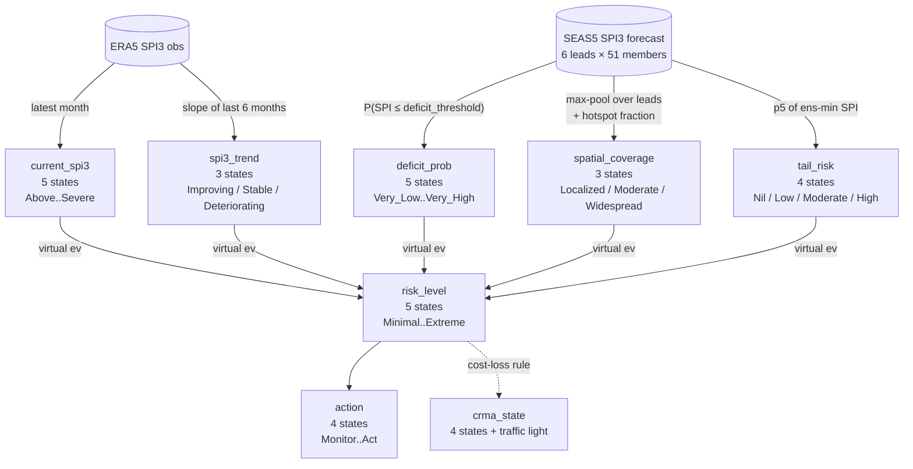

# Drought BN IBF — interpreting a single boundary's posterior

This page walks through what `drought_bn_ibf_v1.jl` does for **one
admin-1 boundary in one month**. It uses Dikhil district (Djibouti,
`DJI.2_1`) as the running example because its evidence vector swings
across the 13-month sweep — Severe_Drought obs in April 2025, recovery
in summer, Mild drought + deteriorating forecast in early 2026.

The BN engine is identical to flood; only the parent semantics, bin
edges, and CPT stress weights are drought-specific (see
`bn_comparison.md` for the side-by-side).

## 1. The DAG for one boundary, one month



Every parent has *two* incoming edges in the inference graph:

```
parent_state ~ Categorical(uniform_K)              # latent
parent_data  ~ DiscreteTransition(parent_state, I_K)   # virtual evidence
```

`parent_data` is the column we observe (either a one-hot vector for
hard evidence, or a probability vector from the soft-binning
columns `cur_p1..p5, def_p1..p5, spa_p1..p3, trn_p1..p3, tail_p1..p4`
in the prep CSV). The identity-CPT channel `I_K` lets either form be
plugged in without changing the graph.

## 2. Worked example — Dikhil, April 2025

### 2a. Evidence vector from `drought_inputs_2025-04.csv`

```
boundary_id    : DJI.2_1
boundary_name  : Dikhil          (country: Djibouti)

current_spi3              : -2.36   →  Severe_Drought  (idx 5)
trend_slope_spi_per_month : -0.56   →  Deteriorating   (idx 3)
forecast_deficit_prob     :  0.45   →  Medium          (idx 3)
spatial_coverage          :  1.00   →  Widespread      (idx 3)
forecast_agreement        :  Medium →  Medium          (idx 2; node disabled by default)
ens_min_spi               : -4.00   →  High drought    (idx 4)
```

Soft-evidence columns (Gaussian-binned around the float value):

```
cur_p1..p5  = [0.000, 0.000, 0.000, 0.002, 0.998]   # P(Above..Severe)
def_p1..p5  = [0.001, 0.155, 0.665, 0.179, 0.000]   # P(Very_Low..Very_High)
spa_p1..p3  = [0.000, 0.000, 1.000]                 # P(Localized..Widespread)
trn_p1..p3  = [0.000, 0.004, 0.996]                 # P(Improving..Deteriorating)
tail_p1..p4 = [0.000, 0.000, 0.000, 1.000]          # P(Nil..High)
```

The hard categorisation and the `argmax` of the soft vector agree —
that's the sanity check the prep emits.

### 2b. CPT lookup — `compute_risk_probs(c=5, d=3, s=3, t=3, agr=2, tail=4)`

The CPT in `drought_bn_ibf_v1.jl` works in two passes:

**Pass 1 — base risk score** (continuous, on a 0–4 scale):

```
base_risk = 0.30·(c-1) + 0.55·(d-1)        # current + deficit
          + spatial_modifier               # 0.0 / 0.25 / 0.50 for L/M/W
          + trend_modifier                 # -0.30 / 0 / +0.35 for I/S/D
          + tail_modifier                  # 0.0 / 0.10 / 0.35 / 0.60 for N/L/M/H
```

For Dikhil April:

```
base = 0.30·(5-1) + 0.55·(3-1)        = 1.20 + 1.10  = 2.30
     + 0.50  (Widespread spatial)                    = 2.80
     + 0.35  (Deteriorating trend)                   = 3.15
     + 0.60  (High tail)                             = 3.75
```

**Pass 2 — expert-rule overrides** check 8 specific scenario shapes
*before* the bin cutoffs of `base_risk`. The first matching rule
wins. They are listed (order matters!) in `compute_risk_probs`:

| # | Trigger condition (in 0-based parent indices) | Risk vec [Min, Low, Mod, High, Ext] |
|---|---|---|
| 1 | Severe_Drought + Very_High deficit + Deteriorating + (Mod/Wide) | `[0, 0, 0.05, 0.20, 0.75]` |
| 2 | (Moderate/Severe) + (High/Very_High) deficit + Deteriorating | `[0, 0, 0.10, 0.50, 0.40]` |
| **T1** | **Tail ≥ Mod + already dry (≥Mild) + low mean deficit (≤Low)** | **High tail: `[0, 0.10, 0.30, 0.45, 0.15]`** ← Dikhil April |
| T2 | High tail + Very_Low deficit | `[0.05, 0.20, 0.40, 0.30, 0.05]` |
| T3 | Tail ≥ Mod + Deteriorating + low deficit | `[0.05, 0.15, 0.45, 0.30, 0.05]` |
| 3 | Above_Normal + low deficit + no tail risk | `[0.55, 0.35, 0.10, 0, 0]` |
| 4 | Improving + already-good state + low deficit | `[0.65, 0.30, 0.05, 0, 0]` |
| 5 | High forecast deficit but currently OK | `[0.10, 0.25, 0.45, 0.15, 0.05]` |
| (fallback) | Bin on `base_risk` (5 cutoffs at 1, 2, 3, 4) | continuous |

For Dikhil April: rules 1–2 don't fire (deficit only Medium, not
≥High). Rule **T1** fires because:

- `tr ≥ 2` ✓ (tail = High = idx 4, tail-1 = 3 ≥ 2)
- `c ≥ 3` ✓ (current = Severe_Drought = idx 5, c-1 = 4 ≥ 3)
- `d ≤ 2` ✓ (deficit = Medium = idx 3, d-1 = 2 ≤ 2)

→ `[0.0, 0.10, 0.30, 0.45, 0.15]`

**Pass 3 — agreement softening** (forecast_agreement = Medium = idx 2):

```
probs ← 0.8·probs + 0.2·uniform_5
      = 0.8·[0, 0.10, 0.30, 0.45, 0.15] + 0.2·[0.20]
      = [0.04, 0.12, 0.28, 0.40, 0.16]
```

`argmax` → `risk_level = High`.

### 2c. CRMA decision (cost-loss rule, γ = 0.20)

```
P(High ∪ Extreme) = 0.40 + 0.16 = 0.56  ≥ γ = 0.20   → Actionable_Risk
```

Output row in `drought_bn_v1_2025-04.csv`:

```
boundary_id           : DJI.2_1
risk_minimal,low,mod,high,ext : 0.04 / 0.12 / 0.28 / 0.40 / 0.16
risk_level            : High
crma_state            : Actionable_Risk
traffic_light         : Red
crma_explanation      : "P(High∪Extreme)=0.56 ≥ C/L=0.20"
```

## 3. How the BN actually computes this — soft path

The hard-evidence walkthrough above is a CPT lookup. RxInfer's
message-passing path produces the **same** number when soft-evidence
is one-hot. The reason to keep the message-passing engine is that
when the soft columns are *not* one-hot — e.g. `cur_p4 = 0.4,
cur_p5 = 0.6` — RxInfer marginalises over both states correctly:

```
P(risk) = Σ_c Σ_d Σ_s Σ_t Σ_tail T[risk | c, d, s, t, tail]
         · cur_p[c] · def_p[d] · spa_p[s] · trn_p[t] · tail_p[tail]
```

That is **exactly** the tensor contraction `infer_soft_matmul()`
implements, and it agrees with RxInfer to ≤ 1.5 × 10⁻⁹ on every
test case. The matmul path is used for the bulk per-member runs
(115 k inferences per multi-day window in flood); RxInfer is the
operational default per-boundary.

## 4. Reading the result CSV

`drought_bn_v1_YYYY-MM.csv` columns:

```
boundary_id, boundary_name, country
current_spi3_category    # echoed from prep, helpful for debugging
spi3_trend
risk_level               # argmax of risk_minimal..risk_extreme
crma_state               # Monitor / Evaluate / Assess / Actionable_Risk
traffic_light            # Green / Yellow / Orange / Red
crma_explanation         # which threshold fired
recommended_action       # legacy (use crma_state instead)
confidence               # max action prob, legacy
risk_minimal             ┐
risk_low                 │
risk_moderate            │ posterior over the 5 risk states
risk_high                │ (sums to 1 ± 1e-6)
risk_extreme             ┘
action_monitor           ┐
action_alert             │ posterior over the 4 (legacy) action
action_prepare           │ states; CRMA is now derived from risk_*
action_act               ┘ via the cost-loss rule (Layer-1 output).
```

**Operational rule**: in production, use `crma_state` and
`traffic_light`. The legacy `recommended_action` columns are
preserved for backwards compatibility but should not drive decisions
(see `flood_ibf/decision-output-riskassessment.md` for the rationale).

## 5. Interpreting the trajectory across months

For Dikhil:

| Init     | cur_spi3   | def_p | trend         | ens_min | risk_level | crma_state    |
|----------|------------|-------|---------------|---------|------------|---------------|
| 2025-04  | -2.36 Sev  | 0.45  | Deteriorating | -4.0    | High       | Actionable    |
| 2025-05  | -2.18 Sev  | 0.42  | Deteriorating | -3.91   | High       | Actionable    |
| 2025-06  | -3.03 Sev  | 0.65  | Deteriorating | -3.42   | Extreme    | Actionable    |
| 2025-07  | -1.61 Sev  | 0.34  | Improving     | -4.0    | Moderate   | Assess        |
| 2025-08  | +0.64 Above| 0.25  | Improving     | -4.0    | Low        | Monitor       |
| ...      | ...        | ...   | ...           | ...     | ...        | ...           |
| 2026-04  | -0.79 Mild | 0.71  | Deteriorating | -4.0    | High       | Actionable    |

What this tells the analyst:

- **Apr-Jun 2025**: extreme tail risk + already in Severe drought →
  the BN flagged Actionable each month even though the *mean* deficit
  prob (0.45–0.65) was only Medium. **Rule T1** is doing the work —
  capturing the "any-member-could-disaster" signal that a mean would
  smooth away.
- **Jul-Aug 2025**: trend flipped to Improving and obs SPI recovered;
  risk dropped to Low/Moderate, traffic light turned Green/Yellow.
- **Sep-Oct 2025**: forecast tail still Severe, Improving trend
  prevented Actionable but kept it at Assess — the BN is not letting
  a positive obs trend whitewash a negative forecast tail.
- **Apr 2026**: deficit prob jumped to 0.71 (≥High bin) while
  current was Mild_Drought + Deteriorating → rule 2 fires
  (`[0, 0, 0.10, 0.50, 0.40]`), risk High again.

The same five evidence-fields can put a boundary anywhere from
Monitor to Actionable_Risk, and the explanation column tells you
*which* threshold tripped. Use it.

## 6. Common-sense diagnostics

When a result looks surprising, run through this checklist:

1. **Do the soft columns agree with the hard category?**
   For `cur_p1..p5` the argmax should match `current_spi3_category`.
   If not, the prep wrote them in the wrong order (this happened
   once — the `cur`/`tail`/`trn` columns needed reversing to match
   the Julia STATES ordering; see commit history). All five soft
   columns *should* sum to 1 within ε.
2. **Does `crma_explanation` match the posterior?**
   `Actionable_Risk` ↔ `P(High∪Extreme) ≥ γ`. If the posterior
   says e.g. 0.05 + 0.10 = 0.15 < 0.20, you should *not* see Red.
3. **Is `tail_risk` saturating at High?**
   With the SPI clip at ±4 (default), `ens_min_spi` of −4.0
   produces `tail_p4 = 1.0` whenever any single member of the 51
   forecasts an extreme value. This is realistic for monthly leads
   but it does mean Rule T1 / T2 fire often. Tune `--clip-spi`
   (e.g. 3.0) or change the BN tail bin cutoffs if the
   sensitivity is too aggressive.
4. **Did one expert rule dominate every boundary?**
   If 200/227 boundaries cite the same rule, the data may be
   pathological (e.g. all of EA in 2026-04 has `ens_min_spi ≤ -3.5`
   because of the leaky upstream gamma fit — rule T1 fires
   everywhere). The rule weights in `compute_risk_probs` are the
   tuning knob.

## 7. Per-member storyline (worst / median / best)

Beyond the aggregate posterior, `drought_bn_ibf_v1.jl` includes
`run_per_member_bn(member_csv)` which runs the BN on the per-member
sidecar from `drought_data_prep.py --member-evidence-sidecar`. The
helper `select_storylines(member_results)` picks three members per
boundary by `P(High ∪ Extreme)`:

- **worst storyline** = highest-risk plausible member (the analyst's
  "what if the bad scenario lands?" question)
- **median storyline** = central tendency (the BN's modal expectation)
- **best storyline** = the optimistic member

The "probability" column on each storyline row reports the empirical
probability of a member at-least-this-bad — i.e.
`#members ≥ p_high_extreme(this) / 51`. A boundary with the worst
storyline at p_high_extreme = 0.85 and probability = 4 / 51 ≈ 0.08
means: there is ~8 % ensemble support for an outcome with 85 % chance
of High/Extreme drought risk. Treat that as the upper bound for an
operational anticipatory-action trigger.

## 8. Where to look next when calibrating

- **`compute_risk_probs` weights** — base coefficients (0.30 / 0.55 /
  0.50 / 0.35 / 0.60 etc.) are first-pass values copied from the
  flood model. Reviewing them against historical drought events
  (HoA 2010, 2016, 2020-22) is the next calibration step.
- **Expert-rule probability vectors** — the 8 hardcoded `[..]`
  vectors can be tuned. Rule T1 (`[0, 0.10, 0.30, 0.45, 0.15]` for
  high tail) is the most operationally consequential.
- **Bin cutoffs** — currently SPI cutoffs at -1.5/-1.0/-0.5/0.5
  follow McKee. Pixel-empirical cutoffs (the bottom 5/15/30 % of
  historical SPI3 per pixel) would be a meaningful upgrade.
- **Cost-loss `γ`** — 0.20 is the flood default. For drought
  cash transfers, FbF cost-loss tables suggest 0.10–0.15;
  `--cost-loss-ratio 0.10` is a one-flag change.

The Julia engine itself does not need touching for any of these —
the calibration knobs are all in domain code.
